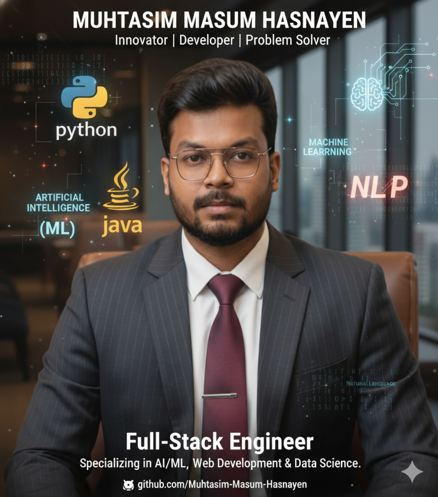

<div align="center">

<!-- ===================== HEADER ===================== -->

<div align="center">


</div>

<br>

<!-- ===================== PROFILE IMAGE ===================== -->



<br><br>

<!-- ===================== TYPING ANIMATION ===================== -->


<br>

<!-- ===================== FUTURISTIC SOCIAL HUB ===================== -->

<div align="center">

## ` CONNECT_WITH_ME`


<br>

<!-- GitHub -->

<a href="https://github.com/Muhtasim-Masum-Hasnayen">

</a>
&nbsp;&nbsp;&nbsp;&nbsp;

<a href="https://www.linkedin.com/in/muhtasim-masum-hasnayen-048517273/">

</a>

<!-- Facebook -->

<a href="https://www.facebook.com/mh.masum.908">

</a>
&nbsp;&nbsp;&nbsp;&nbsp;

<!-- Instagram -->

<a href="https://www.instagram.com/MH_MASUM209/">

</a>
&nbsp;&nbsp;&nbsp;&nbsp;

<!-- X -->

<a href="https://twitter.com/HasnayenMasum">

</a>
&nbsp;&nbsp;&nbsp;&nbsp;

<!-- Gmail -->

<a href="mailto:hasnayenmasum@gmail.com">

</a>
&nbsp;&nbsp;&nbsp;&nbsp;

<!-- WhatsApp -->

<a href="https://wa.me/8801730202960">

</a>

<br><br>
<div align="center">


</div>
<!-- Animated Divider -->


<br>

<!-- Profile Views -->


<br><br>


</div>

---


<div align="center">


### `⚡ CONNECT • COLLABORATE • CREATE ⚡`

</div>

---

## ` ABOUT`

```text
👨‍💻 Web Developer
🧪 Software Quality Assurance Enthusiast
⚙️ Test Automation Explorer
🤖 AI/ML & NLP Enthusiast

Building reliable software.
Testing beyond the happy path.
Automating repetitive work.
Always learning. 🚀
```

---

## `TECH_STACK`

<div align="center">


<br><br>


</div>

---

## ` FOCUS`

```text
Web Development  ────────────────► █████████░ 90%
Software Testing ────────────────► █████████░ 90%
Test Automation  ────────────────► ████████░░ 80%
API Testing      ────────────────► ████████░░ 80%
AI / ML          ────────────────► ██████░░░░ 60%
```

---

## ` PROJECTS`

| 🚀 Project                      | 🔧 Focus                      |
| :------------------------------ | :---------------------------- |
| 🧪 **E-Commerce QA Automation** | Playwright • API • Regression |
| 🤖 **AI Test Case Generator**   | AI • QA • Automation          |
| 🌾 **SmartKrishi**              | PHP • MySQL • Web             |
| 🔐 **Adaptive MFA**             | ML • Security • Risk Analysis |

---

## ` GITHUB`

<div align="center">

<picture>
  <source media="(prefers-color-scheme: dark)" srcset="https://github-readme-stats.vercel.app/api?username=Muhtasim-Masum-Hasnayen&show_icons=true&theme=tokyonight&hide_border=true&count_private=true">
  <source media="(prefers-color-scheme: light)" srcset="https://github-readme-stats.vercel.app/api?username=Muhtasim-Masum-Hasnayen&show_icons=true&theme=default&hide_border=true&count_private=true">
  
</picture>

<picture>
  <source media="(prefers-color-scheme: dark)" srcset="https://github-readme-stats.vercel.app/api/top-langs/?username=Muhtasim-Masum-Hasnayen&layout=compact&theme=tokyonight&hide_border=true">
  <source media="(prefers-color-scheme: light)" srcset="https://github-readme-stats.vercel.app/api/top-langs/?username=Muhtasim-Masum-Hasnayen&layout=compact&theme=default&hide_border=true">
  
</picture>

<br><br>


<br><br>


</div>

---

<div align="center">

### `⚡ BUILD • TEST • AUTOMATE • INNOVATE ⚡`

<br>


<br>

<div align="center">


</div>

</div>
